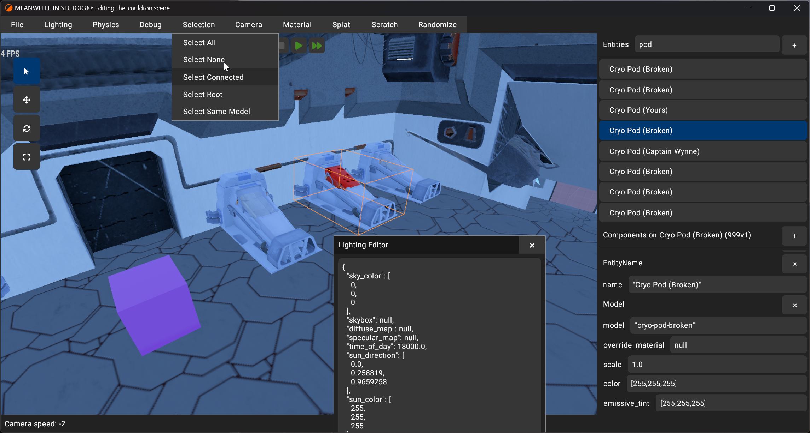

<div align="center">
    <h1>yakui</h1>
    <p>yakui is a declarative Rust UI library for games.</p>
</div>

<div align="center">
    <a href="https://github.com/SecondHalfGames/yakui/actions"></a>
    <a href="https://crates.io/crates/yakui"></a>
    <a href="https://docs.rs/yakui"></a>
    <a href="https://www.patreon.com/lpghatguy"></a>
</div>

<div>&nbsp;</div>

**yakui is a work in progress. Feedback is welcome, but mind the dragons, sharp edges, and exposed nails!**

yakui combines a layout model inspired by [Flutter] with the ease-of-use of an immediate mode UI library like [Dear Imgui] or [egui].

yakui has the following priorities:

1. Flexibility — yakui must be able to represent any widget
2. Ergonomics — yakui must be terse, but must enable the user to go outside the box
3. Performance — yakui must be fast enough to use in a shipping game

<div align="center">
    <div></div>
    <label for="#panels">yakui being used in the editor for <a href="https://secondhalf.games/">MS80</a></code></label>
</div>

[Flutter]: https://flutter.dev/
[Dear Imgui]: https://github.com/ocornut/imgui
[egui]: https://github.com/emilk/egui

## Table of Contents
* [Getting Started](#getting-started)
* [Examples](#examples)
* [Rationale](#rationale)
* [Architecture](#architecture)
* [Crates](#crates)
* [Games Using yakui](#games-using-yakui)
* [Name](#name)
* [Minimum Supported Rust Version (MSRV)](#minimum-supported-rust-version-msrv)
* [License](#license)

## Getting Started
Add the [`yakui`] crate to your project:

```toml
[dependencies]
yakui = { git = "https://github.com/SecondHalfGames/yakui" }
```

Create a [`yakui::Yakui`] when your game starts:

```rust
let mut yak = yakui::Yakui::new();
```

Call `start()`, create your UI, then call `finish()`:

```rust
yak.start();

yakui::center(|| {
    yakui::text(32.0, "Hello, world!");
});

yak.finish();
```

Finally, call `paint()` and feed the result to your renderer:

```rust
your_renderer.draw(yak.paint());
```

To see your UI, you'll need a renderer crate. You can also write your own integration for your game. Here are the officially supported renderer crates:

- [`yakui-wgpu`] — wgpu renderer
- [`yakui-vulkan`] — Vulkan renderer

You'll also need to send window and input events to yakui. These are the officially supported windowing library crates:

- [`yakui-winit`] — Winit integration

[`yakui::Yakui`]: https://github.com/SecondHalfGames/yakui/blob/main/crates/yakui-core/src/state.rs

## Examples
Example setup code for yakui is available in [`crates/bootstrap`](crates/bootstrap).

You can run examples with `cargo run --example <example name>`. Check out [`crates/yakui/examples`](crates/yakui/examples) to get a list of available examples.

Many of the examples look like this:

```rust
fn app() {
    yakui::column(|| {
        yakui::text(32.0, "Hello, world!");

        if yakui::button("Click me!").clicked {
            println!("Button clicked.");
        }
    })
}
```

In these examples, the `app` function is run every frame, processing input and updating the UI. This replicates how games tend to work.

## Rationale
yakui exists to fill two roles in the Rust game UI ecosystem:

1. A library for prototype, development, or debug game UI
2. A library for building polished, custom game UI

Most importantly, yakui provides a smooth transition from #1 to #2. When you reach the phase of your game's development where custom UI makes sense, you shouldn't need to throw out your existing UI code or technology. You should be able to incrementally improve the look, fit, and feel of your UI.

While Rust has multiple libraries aimed at debug or development UI, they do not place an emphasis on being capable for building good custom game UI. None of them provide a gradual path for converting from UI suitable for a game prototype into polished UI for a quality shipping game. All of yakui's built-in widgets are created using public APIs and are easy to compose, extend, or fork.

Many Rust UI libraries have expanded their scope to become desktop application toolkits. This leaves their core proficiency half-baked. yakui will always be focused on practical problems encountered building game UI.

Most attempts at building UI libraries have limited layout capabilities, making some kinds of widgets impossible to express. yakui is built upon Flutter's layout protocol, which can efficiently handle both bottom-up and top-down sizing when appropriate.

## Architecture
yakui stands on the shoulders of giants.

It takes heavy inspiration from:
* [React] — Declarative UI as a mainstream paradigm
* [Flutter] — Single pass layout model, composable layout widgets
* [Moxie] — Constructing UI as a tree of topologically-aware functions

A frame in yakui is divided up into distinct phases:

1. Event Phase
    * Events are piped from the application into yakui and tested against the current DOM.
    * Widgets can sink or bubble events. Events bubble by default, and any events that bubble are given back to the application.
2. Update Phase
    * This phase is started when `Yakui::start` is called. This binds the DOM to the current thread.
    * Functions are called that declare widgets and their current state.
    * Widgets that existed last frame are updated with new props, the input to a widget.
    * Widgets that didn't exist are created from props.
3. Layout Phase
    * This phase is started when `Yakui::finish` is called. This unbinds the DOM from the current thread.
    * Each widget has its layout function run once, depth first.
    * Each widget is asked what events it is interested in receiving, like mouse or keyboard events.
4. Paint Phase
    * This phase is started when `Yakui::paint` is called.
    * Each widget has its paint function run once, depth first.
    * Paint information is stored in the Paint DOM, which a renderer can use to draw the current set of widgets.

[React]: https://reactjs.org/
[Moxie]: https://moxie.rs/

## Crates
yakui is modular to support different kinds of users.

### [`yakui`]
The `yakui` crate bundles together `yakui-core` with `yakui-widgets` to provide a pleasant out of the box experience.

If you're writing a game and want to use yakui, this is the crate to start with.

[`yakui`]: https://crates.io/crates/yakui

### [`yakui-core`]
The `yakui-core` crate defines the DOM, layout, painting, and input, but provides no built-in widgets nor bindings to other libraries.

If you're working on a library that depends on yakui like a renderer or platform crate, this is the crate to use.

[`yakui-core`]: https://crates.io/crates/yakui-core

### [`yakui-widgets`]
The `yakui-widgets` crate is a collection of built-in widgets for yakui. This includes layout primitives, text rendering, and basic form controls.

You should usually not depend on `yakui-widgets` directly. Instead, depend on `yakui` if you want to use these widgets, or `yakui-core` if you don't need widgets.

[`yakui-widgets`]: https://crates.io/crates/yakui-widgets

### [`yakui-winit`]
The `yakui-winit` crate contains bindings for use with [winit].

[`yakui-winit`]: https://crates.io/crates/yakui-winit
[winit]: https://github.com/rust-windowing/winit

### [`yakui-wgpu`]
The `yakui-wgpu` crate is a yakui renderer that uses [wgpu].

[`yakui-wgpu`]: https://crates.io/crates/yakui-wgpu
[wgpu]: https://wgpu.rs/

### [`yakui-vulkan`]
The `yakui-vulkan` crate is a yakui renderer that uses Vulkan via [ash]

[`yakui-vulkan`]: https://crates.io/crates/yakui-vulkan
[ash]: https://crates.io/crates/ash

### [`yakui-app`]
The `yakui-app` crate is a wrapper around `yakui-winit` and `yakui-wgpu` intended to make getting started with yakui easier.

If you are writing your own integration for yakui, this crate is a good learning resource to reference.

[`yakui-app`]: https://crates.io/crates/yakui-app

## Games Using yakui
There are a handful of games already using yakui for their UI. Here are a couple:

* [MEANWHILE IN SECTOR 80](https://ms80.space)
* [Zombie Demo Game](https://lpghatguy.itch.io/zombie-demo-game)
* [CyberGate](https://www.youtube.com/watch?v=msHuaPAJZMo)

## Name
yakui is all lowercase.

yakui is pronounced however you want to pronounce it. Here are some suggestions:

* *ya-KOO-ee* (like a sneeze)
* *yak-yew-eye* (like a marketing executive)
* *ya-kwee* (like a funny French word)

## Minimum Supported Rust Version (MSRV)
yakui currently supports the latest stable version of Rust. Once yakui has matured, the MSRV will be pinned and updated only when it provides a large improvement.

## License
Licensed under either of

* Apache License, Version 2.0, ([LICENSE-APACHE](LICENSE-APACHE) or http://www.apache.org/licenses/LICENSE-2.0)
* MIT license ([LICENSE-MIT](LICENSE-MIT) or http://opensource.org/licenses/MIT)

at your option.

### Contribution
Unless you explicitly state otherwise, any contribution intentionally submitted for inclusion in the work by you, as defined in the Apache-2.0 license, shall be dual licensed as above, without any additional terms or conditions.